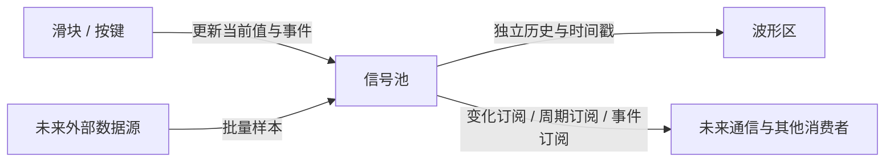

# SignalDesk

一个原生桌面信号工作区，聚焦 **信号池、波形绘制区、控件区** 三个可复用组件。采用 PySide6 / Qt Widgets、pyqtgraph 和 NumPy；不是网页或 WebView，不依赖电机固件、RTT、J-Link 或某种通信协议。

## 运行

Windows 便携版入口是 `dist/SignalDesk/SignalDesk.exe`。请保留整个 `SignalDesk` 目录，包括 `_internal`。EXE 内带运行时，不需要另外安装 Python；运行目录应可写，配置存放在其旁边的 `user-data`。源码仓库不提交 EXE、依赖包或个人配置。

从源码运行（Python 3.11+）：

```powershell
python -m venv .venv
.venv/Scripts/python.exe -m pip install -e ".[build]"
.venv/Scripts/python.exe run.py
```

`--no-demo` 关闭模拟数据；`--fresh` 忽略保存的布局和控件配置，使用默认设置；`--data-dir PATH` 使用独立配置目录。默认的正弦与跟随曲线是明确标注的本地模拟数据，没有任何设备连接或使能动作。

## 三个组件



**信号池**是公共接口，保存元数据、当前值、历史和有限长度的事件记录。控件更新池里的值，波形读池里的历史，消费者不读 QWidget。一个信号可供多个消费者订阅，每个消费者有自己的策略；订阅失败不会阻止其他订阅者，错误保存在 `subscriber_errors`。

**波形区**保留可停靠、分割、标签组合和浮动的多个窗格。支持滚动与心电图扫屏、暂停、X/Y 平移缩放、四个可选 X 同步组。不同频率信号保留各自时间戳，不插值、不补齐；密集数据按像素保留首点、峰值、谷值、末点，放大恢复原始点。默认细点线、点线同色、固定 Y、无网格及十字线。

**控件区**目前只包含滑块和按键。顶部新建，右键或 `···` 配置；名称、稳定信号 ID、范围、初值、步进、历史记录频率均可配置。移除控件只停止该生产者，已产生的信号历史仍保留到关闭工作区。配置保留的是启动初值，不把上次运行中的开关状态偷偷恢复。

## 更新与订阅的含义

**多个控件可以绑定同一信号。** “控件 ID”各自唯一，“绑定信号”可以重复，可从下拉框选择已有信号。例如建立“使能”和“失能”两个按键，都绑定 `motor.enabled`，行为都选“写入固定值”，按下值分别为 1 和 0。信号池只出现一条变量，两个控件和波形共享它的当前值。

初值只用于首次创建信号；添加第二个控件、重新绑定或修改配置不会重置已有变量。控件名称与信号显示名称独立，信号名称在左栏右键配置。多个控件共享信号时，历史频率取最高请求值，任一控件选择周期记录即周期记录，统一采样且不叠加点率。写入按实际操作顺序生效，最后一次写入为当前值；“按住 / 松开”的松开也算一次写入。移除一个控件不影响其他绑定者。

| 层次 | 何时更新 | 谁决定频率 |
| --- | --- | --- |
| 当前值 | 操作控件后立即更新，`pool.latest` / `snapshot` 随时可读 | 不等待历史定时器 |
| 波形历史 | 周期记录当前值，或只在变化后限速记录 | 每个控件的 `history_hz` / `history_mode` |
| 值订阅 | 值变化通知，或周期获取最新快照 | 每个订阅者的 `mode` / `hz` |
| 按键事件 | 每次按下、松开各记一条带序号的事件 | 不按采样率丢弃边沿 |
| 绘图刷新 | 默认目标约 60 Hz | 波形组件自身 |

例如，滑块历史记录 50 Hz，通信消费者可以变化时通知，也可以用 500 Hz 获取最新值；这不会让滑块历史变成 500 Hz。限制变化订阅频率时，中间多次变化合并为最新值；若每次动作都不能丢，应订阅事件。按键从 0 快速变成 1 又回到 0 时，低频数值历史可能只看到 0，但事件里仍有完整按下、松开。

频率都是主机上的目标节奏，受系统调度和负载影响。控件历史目标范围 0.1～1000 Hz，应用定时器随需求调整至 1～10 ms；延迟时跳过过期周期，不伪造补采点。左栏显示**实际历史点率**，不能据此推断硬件采样率或通信吞吐。当前值即使未到下一个历史记录时刻也会在左栏刷新。

## 按键保持简单

| 行为 | 点击效果 | 用途示例 |
| --- | --- | --- |
| 两值切换（默认 0 / 1） | 每次按下切换 A / B | 本地开关意图 |
| 按住 / 松开 | 按下为 B，松开为 A；应用失去激活时也松开 | 点动意图 |
| 写入固定值 | 每次按下写指定值，并产生新事件 | 复位目标、离散请求 |
| 递增 / 递减 | 当前值加指定增量，到上下限钳位 | 计数、步进目标 |

按键不会自行执行“使能电机”等业务动作。下游适配器决定如何解释信号和事件、如何确认设备结果。初版不加入任意表达式、脚本执行或动作编排。

## 界面操作

- 左栏：淡化实收点率、彩色名称、右对齐当前值。默认不加单位；右键可开启已配置单位显示。无分类树和搜索框。
- 双击信号或多选拖入波形；右键可复制 ID/当前值、配置和查看最近按键事件。悬停看来源、真实点率、批次率、时间戳和停更信息。
- 波形普通点击不暂停；左键拖动平移；滚轮缩放时间，Ctrl + 滚轮缩放 Y，Shift + 拖动框选。
- 点线不做平滑。标记挤在一起时自动省略，避免缩小时变粗；放大后恢复。
- 绘图区不常驻显示采样数、渲染点数等内部状态，空间用于波形；主动开启十字线时，可悬停查看采样读数。
- 波形右键选择 X 同步组 1～4，默认不同步。同组共享 X 视图、跟随和扫屏模式，Y 与数据暂停独立。
- 空格只在波形画布获得焦点时暂停该窗格，不抢占按键控件的键盘操作。
- 控件配置自动保存，也可在“工作区”菜单导出/导入合并。布局退出时保存；外部信号的显示名称和单位单独保存。

## 嵌入与扩展

核心模型不依赖 Qt；GUI 组件按需导入。参见 [API.md](API.md) 和 [examples/subscriptions.py](examples/subscriptions.py)。

| 模块 | 职责 |
| --- | --- |
| `data.py` | 元数据、镜像环形历史、即时值、值/事件订阅与快照 |
| `control_model.py` | 控件约束、历史调度、四种按键行为，不含协议 |
| `controls.py` | 滑块、按键、配置对话框 |
| `workspace.py` | 信号池列表与 Qt 停靠容器 |
| `plot.py` / `rendering.py` | 波形交互、可见范围裁剪和像素峰谷抽稀 |
| `x_sync.py` | 四个可选 X 轴同步组 |
| `inbox.py` | 外部线程到信号池的有界批次入口 |
| `demo.py` / `app.py` | 可替换的模拟数据与示例宿主 |

当前默认最多 32 个信号、12 个波形窗格、每窗格 16 条曲线。每信号历史 262144 点，20 kHz 约 13.1 秒，约 6 MiB；暂停需要额外快照内存。历史值是 float32，当前值是 Python float，不应把波形缓存用作大整数或 double 的无损记录器。事件最多保留 1024 条；落后消费者收到明确的丢失条数，无静默重放。

## 检查与打包

```powershell
.venv/Scripts/python.exe -m unittest discover -s tests -v
.venv/Scripts/python.exe run.py --smoke --data-dir build/smoke
./build.ps1
```

Windows 打包包含系统 ICU 依赖审计，避免加载到其他工具带来的同名不兼容 DLL。GUI 使用 Qt CPU 绘制，尚未启用 OpenGL；EXE 并非全 C++ 重写。当前验证范围见 [VALIDATION.md](VALIDATION.md)。

第三方依赖保留各自许可；本仓库尚未指定源代码授权许可证。
